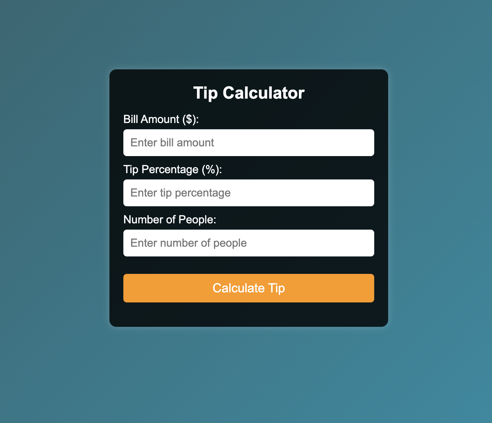

# 💰 Day 17 Tip Calculator  

A sleek and user-friendly **Tip Calculator** that helps users quickly calculate the tip amount and split the bill among friends. Built with **HTML, CSS, and JavaScript**, this project is perfect for anyone looking to enhance their front-end development skills.  

## 🚀 Features  
✅ Calculate tip percentages (10%, 15%, 20%, or custom)  
✅ Split the bill among multiple people  
✅ Real-time calculations as you enter values  
✅ Sleek and modern UI design  
✅ Fully responsive for mobile and desktop users  

## 🎯 How to Use  
1. Enter the **bill amount**.  
2. Choose a **tip percentage** or enter a custom tip.  
3. Select the **number of people** splitting the bill.  
4. The total tip and per-person cost will be calculated instantly!  

## 🛠️ Technologies Used  
- **HTML** for structure  
- **CSS** for styling and responsive design  
- **JavaScript** for real-time tip calculations  

---

# Demo page

Click [Here](https://ayshasanyang.github.io/Day-17-tip-calculator/) to view the page

## 🚀 How to Run
1. Download or clone the repository
```bash
git clone https://github.com/ayshasanyang/Day-17-tip-calculator.git
```
2. Navigate to the project folder.
3. Open the project files in your vscode or any code editor of your choice
4. Open the `index.html` file in your web browser.

---

## 📸 Preview
 

---

Made with ❤️ by [AYSHA] 🚀